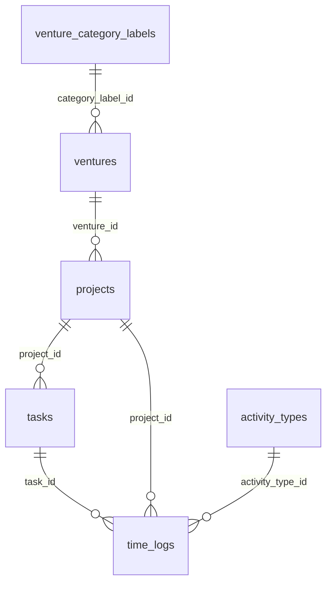

# Database schema

This document describes the **persisted relational schema** used by the Momentum backend as implemented in code and Alembic migrations. It is intended for developers and AI agents working in this repository.

## Database rules
- Do not create a new table by default.
- Do not embed child records in JSON/arrays by default.
- Choose a separate table when child records have their own query patterns, filters, sorting, joins, constraints, lifecycle, or updates.
- Choose embedded JSON/arrays only when the data is truly subordinate, retrieved together, updated together, and not queried independently.
- Migration creation requires explicit approval, but schema recommendations must still state when a new table is the correct design.

---

## High-level overview

| Topic | Detail |
|--------|--------|
| **Engine** | **SQLite** via SQLAlchemy / SQLModel (`create_engine` in `backend/app/db/database.py`). |
| **Connection URL** | From settings: `MOMENTUM_DATABASE_URL`, default `sqlite:///data/momentum.db` (`backend/app/core/config.py`). Relative paths are resolved against the process current working directory; parent directories are created for file-backed SQLite URLs. |
| **Migrations** | **Alembic**; scripts live under `backend/app/db/migrations/versions/`. `init_db()` runs `alembic upgrade head` on application startup (`backend/app/db/database.py`). |
| **ORM models (tables)** | SQLModel `table=True` classes under `backend/app/models/`. These are the primary in-code definition of columns and types alongside migrations. |

### Sources of truth (and how they relate)

1. **Alembic revisions** (`backend/app/db/migrations/versions/*.py`) — authoritative for **what exists in migrated databases**, including server defaults, `UNIQUE` constraints, and foreign key names.
2. **SQLModel classes** (`backend/app/models/*.py`) — authoritative for **application-level defaults** (e.g. Python `default_factory` for IDs and timestamps) and fields the ORM expects.
3. **Minor discrepancies** — e.g. `created_at` / `updated_at` on `time_logs`: early migrations set non-null columns without `server_default`; new rows rely on model `default_factory` in Python. When in doubt, compare the **latest migration** with the **model** for a given table.

**Timestamp helper:** application-level timestamp defaults and service-side timestamp updates use the shared `app.core.time.utc_now()` helper unless a historical migration or test intentionally keeps a local timestamp function.

There is **no multi-tenant schema**: no `account_id` or similar column appears in models or migrations.

---

## Tables (models)

The application uses **six** tables, one-to-one with SQLModel table classes.

### 1. `venture_category_labels`

| | |
|--|--|
| **Purpose** | Normalized labels for venture “categories” (e.g. Hustle, Business). Referenced by `ventures.category_label_id`. |
| **SQLModel** | `VentureCategoryLabel` — `backend/app/models/venture_category_label.py` |
| **Created / altered in** | `20260515_0004_phase_1_6_foundation.py` (create + seed rows) |

| Column | DB / model type | Required | Default | PK / FK / unique | Notes |
|--------|-----------------|----------|---------|------------------|-------|
| `id` | `String` | Yes | UUID string (`default_factory` in model) | **PK** | Application-generated string UUID. |
| `name` | `String` | Yes | — | | Display name. |
| `slug` | `String` | Yes | — | **UNIQUE** (migration) | Lowercase identifier; uniqueness enforced in DB and again in service layer (case-insensitive check in `venture_category_labels` service). |
| `created_at` | `DateTime(timezone=True)` | Yes | Model: `utc_now()` | | Set in Python on insert. |
| `updated_at` | `DateTime(timezone=True)` | Yes | Model: `utc_now()` | | Updated on label update in service. |

**Indexes (explicit in migrations):** None beyond primary key and unique on `slug`.

**Example row (illustrative JSON):**

```json
{
  "id": "a1b2c3d4-e5f6-7890-abcd-ef1234567890",
  "name": "Hustle",
  "slug": "hustle",
  "created_at": "2026-05-15T12:00:00+00:00",
  "updated_at": "2026-05-15T12:00:00+00:00"
}
```

---

### 2. `ventures`

| | |
|--|--|
| **Purpose** | Top-level grouping for projects (“ventures”). |
| **SQLModel** | `Venture` — `backend/app/models/venture.py` |
| **Created / altered in** | `20260515_0004_phase_1_6_foundation.py` (create + seed `Unsorted` venture) |

| Column | DB / model type | Required | Default | PK / FK / unique | Notes |
|--------|-----------------|----------|---------|------------------|-------|
| `id` | `String` | Yes | UUID string | **PK** | |
| `name` | `String` | Yes | — | | |
| `description` | `String` | No | — | | Migration `nullable=True`; model `str \| None = None`. |
| `colour` | `String` | No | — | | Optional palette colour in API validation (`VentureCreate` / `VentureUpdate`). |
| `category_label_id` | `String` | Yes | — | **FK** → `venture_category_labels.id` | |
| `icon` | `String` | No | — | | |
| `status` | `String` | Yes | DB `server_default='active'`; model `default="active"` | | Used as lifecycle: `active` / `archived` (string values enforced in API schemas, not as DB enums). |
| `created_at` | `DateTime(timezone=True)` | Yes | Model `utc_now()` | | |
| `updated_at` | `DateTime(timezone=True)` | Yes | Model `utc_now()` | | |

**Foreign keys:** `category_label_id` → `venture_category_labels.id` (no `ON DELETE` specified in migration).

**Cascade / delete behaviour (application, not DB trigger):** Archiving a venture sets linked **active** projects to archived and sets `archived_by_venture` (`backend/app/services/ventures.py`). Unarchiving restores projects that had `archived_by_venture` true. **Unknown:** DB-level `ON DELETE` if label row were removed (API prevents deleting in-use labels).

---

### 3. `projects`

| | |
|--|--|
| **Purpose** | Projects (and similar work units) optionally under a venture; supports Kanban-style `board_status` and soft “archive” via `status`. |
| **SQLModel** | `Project` — `backend/app/models/project.py` |
| **Created / altered in** | `20260513_0001_create_projects_table.py` → `20260515_0004_phase_1_6_foundation.py` |

| Column | DB / model type | Required | Default | PK / FK / unique | Notes |
|--------|-----------------|----------|---------|------------------|-------|
| `id` | `String` | Yes | UUID string | **PK** | |
| `venture_id` | `String` | No | `NULL` allowed | **FK** → `ventures.id` (`20260515_0004`) | Migration backfill sets all existing projects to seeded `Unsorted` venture. |
| `name` | `String` | Yes | — | | |
| `description` | `String` | No | — | | |
| `colour` | `String` | No | — | | API validates `#RRGGBB` when set (`ProjectCreate` / `ProjectUpdate`). |
| `icon` | `String` | No | — | | Added in `20260515_0004`. |
| `project_type` | `String` | Yes | DB + model default `"project"` | | API literals: `project`, `asset`, `gig`, `contract`. Migration maps legacy `is_asset` → `project_type` if column existed (one-time data migration). |
| `status` | `String` | Yes | DB + model `"active"` | | `active` / `archived` in API. |
| `board_status` | `String` | Yes | DB + model `"active"` | | API literals: `idea`, `active`, `paused`, `shipped`. |
| `kanban_order` | `Integer` | No | — | | Ordering within board column. |
| `finished` | `Boolean` | Yes | `false` | | |
| `archived_by_venture` | `Boolean` | Yes | `false` | | Set when venture archive cascades to project. |
| `created_at` | `DateTime(timezone=True)` | Yes | Model `utc_now()` | | |
| `updated_at` | `DateTime(timezone=True)` | Yes | Model `utc_now()` | | |

**Foreign keys:** `venture_id` → `ventures.id` (constraint name `fk_projects_venture_id_ventures` in migration). No `ON DELETE` clause in migration.

**Legacy column:** `is_asset` — not in current SQLModel; migration `20260515_0004` reads it via `inspector` if present for data migration only. **Not part of the current model.**

---

### 4. `tasks`

| | |
|--|--|
| **Purpose** | Work items belonging to a project. |
| **SQLModel** | `Task` — `backend/app/models/task.py` |
| **Created / altered in** | `20260513_0002_create_tasks_and_time_logs_tables.py` |

| Column | DB / model type | Required | Default | PK / FK / unique | Notes |
|--------|-----------------|----------|---------|------------------|-------|
| `id` | `String` | Yes | UUID string | **PK** | |
| `project_id` | `String` | Yes | — | **FK** → `projects.id` | |
| `title` | `String` | Yes | — | | |
| `description` | `String` | No | — | | |
| `status` | `String` | Yes | `"backlog"` | | Includes `archived` in update paths; create uses Kanban subset in schema. |
| `priority` | `String` | Yes | `"medium"` | | `low` / `medium` / `high` / `urgent` in API. |
| `estimated_hours` | `Float` | No | — | | |
| `actual_hours` | `Float` | Yes | `0` | | **Derived in app:** recomputed from sum of `time_logs.hours` for the task (`backend/app/services/tasks.py`). |
| `target_date` | `Date` | No | — | | |
| `completed_date` | `Date` | No | — | | Set/cleared by service from status transitions. |
| `kanban_order` | `Integer` | No | — | | |
| `created_at` | `DateTime(timezone=True)` | Yes | Model `utc_now()` | | |
| `updated_at` | `DateTime(timezone=True)` | Yes | Model `utc_now()` | | |

**Foreign keys:** `project_id` → `projects.id` (no `ON DELETE` in migration). **Application:** deleting a task hard-deletes the task and archives child time logs (`status='archived'`, `task_id=NULL`) in the same transaction (`delete_task`).

---

### 5. `time_logs`

| | |
|--|--|
| **Purpose** | Time entries linked to a task (and denormalized `project_id`) and optionally an activity type. |
| **SQLModel** | `TimeLog` — `backend/app/models/time_log.py` |
| **Created / altered in** | `20260513_0002` → `20260514_0003` (title, location) → `20260515_0004` (`activity_type_id`) → `20260518_0005` (`status`, nullable `task_id`) |

| Column | DB / model type | Required | Default | PK / FK / unique | Notes |
|--------|-----------------|----------|---------|------------------|-------|
| `id` | `String` | Yes | UUID string | **PK** | |
| `task_id` | `String` | No | — | **FK** → `tasks.id` | Nullable to preserve archived logs after task delete. Active logs remain attached to a task. |
| `project_id` | `String` | Yes | — | **FK** → `projects.id` | Denormalized from the parent task project. Service enforces parity after create/update time-log flushes and cascades active child logs on task project moves. |
| `status` | `String` | Yes | `"active"` | | `active` / `archived`. |
| `activity_type_id` | `String` | No | — | **FK** → `activity_types.id` | Nullable; cleared when activity type is archived (`activity_types.archive_activity_type`). |
| `hours` | `Float` | Yes | — | | Must be > 0 in API validation. |
| `logged_date` | `Date` | Yes | — | | |
| `source` | `String` | Yes | `"manual"` | | API-created logs use `manual`. |
| `external_id` | `String` | No | — | | Reserved for future integrations; not set by current create/update paths in `tasks` service. |
| `notes` | `String` | No | — | | |
| `title` | `String` | No | — | | Added `20260514_0003`. |
| `location` | `String` | No | — | | Added `20260514_0003`. |
| `created_at` | `DateTime(timezone=True)` | Yes | Model `utc_now()` | | No `updated_at` column on this table. |

**Foreign keys:** `task_id`, `project_id`, `activity_type_id` — no `ON DELETE` specified in migrations.

---

### 6. `activity_types`

| | |
|--|--|
| **Purpose** | Categories for time logs (e.g. planning, meeting). |
| **SQLModel** | `ActivityType` — `backend/app/models/activity_type.py` |
| **Created / altered in** | `20260515_0004` (create + seed three rows) |

| Column | DB / model type | Required | Default | PK / FK / unique | Notes |
|--------|-----------------|----------|---------|------------------|-------|
| `id` | `String` | Yes | UUID string | **PK** | |
| `name` | `String` | Yes | — | | Display name; max 25 chars on create/update in Pydantic schema. |
| `slug` | `String` | Yes | — | **UNIQUE** | Slug from name; reserved slug `uncategorised` rejected in service. |
| `status` | `String` | Yes | `"active"` | | `active` / `archived`. |
| `sort_order` | `Integer` | No | — | | Seeded 0,1,2 for default types in migration. |
| `created_at` | `DateTime(timezone=True)` | Yes | Model `utc_now()` | | |
| `updated_at` | `DateTime(timezone=True)` | Yes | Model `utc_now()` | | |

**Application delete rules:** Hard delete blocked if any `time_logs.activity_type_id` references the row; archive sets referencing time logs’ `activity_type_id` to `NULL` (`backend/app/services/activity_types.py`).

---

## Relationships

| From | To | Cardinality | Join / FK | Notes |
|------|-----|-------------|-----------|-------|
| `ventures` | `venture_category_labels` | Many → one | `ventures.category_label_id` | |
| `projects` | `ventures` | Many → one (optional) | `projects.venture_id` | Nullable FK. |
| `tasks` | `projects` | Many → one | `tasks.project_id` | |
| `time_logs` | `tasks` | Many → one | `time_logs.task_id` | Nullable when log is archived on task delete. |
| `time_logs` | `projects` | Many → one | `time_logs.project_id` | Denormalized; service enforces parity with `tasks.project_id` on create/update and cascades active child logs when a task moves projects. |
| `time_logs` | `activity_types` | Many → one (optional) | `time_logs.activity_type_id` | |

**Many-to-many:** None.

**Soft delete:** There is **no** generic `deleted_at` column. **Soft behaviour** uses status fields:

- `projects.status` / `ventures.status` → `archived` means archived in the domain sense.
- `activity_types.status` → `archived` hides type from “active” listing and new log validation; existing FKs cleared on archive in application code.
- `time_logs.status` + nullable `task_id` preserve detached logs when parent task is deleted.

**Hard deletes:** `tasks`, unused `venture_category_labels`, unused `activity_types`.

---

## Mermaid ER diagram



---

## Notable implementation details

| Topic | Behaviour in codebase |
|--------|------------------------|
| **Timestamps** | `Project`, `Task`, `Venture`, `VentureCategoryLabel`, `ActivityType` use `created_at` / `updated_at` where applicable; `TimeLog` only `created_at`. |
| **UUIDs** | Stored as **strings** (UUID string representation), not binary UUID columns. |
| **Enums** | Domain “enums” are **strings** validated in Pydantic (`Literal` types in `backend/app/schemas/`). The database does not use native enum types. |
| **SQLite FK enforcement** | Migrations do not set `PRAGMA foreign_keys` in application code reviewed for this doc. **Unknown** whether SQLAlchemy enables SQLite foreign key enforcement globally; do not rely on DB-level cascades—application services implement deletes. |
| **Seeded data** | `20260515_0004` inserts default venture category labels, one `Unsorted` venture, and three activity types (`planning`, `meeting`, `admin`). |
| **Audit** | No separate audit log table. |

---

## Revision history (Alembic chain)

| Revision | File | Summary |
|----------|------|---------|
| `20260513_0001` | `20260513_0001_create_projects_table.py` | Initial `projects`. |
| `20260513_0002` | `20260513_0002_create_tasks_and_time_logs_tables.py` | `tasks`, `time_logs`. |
| `20260514_0003` | `20260514_0003_add_time_log_title_and_location.py` | Adds `title`, `location` on `time_logs`. |
| `20260515_0004` | `20260515_0004_phase_1_6_foundation.py` | New tables + `projects`/`time_logs` columns + FKs + seed data. |
| `20260518_0005` | `20260518_0005_time_log_status_and_nullable_task_id.py` | Adds `time_logs.status`; makes `time_logs.task_id` nullable for task-delete archive semantics. |

---

## Uncertainties (explicit)

1. **SQLite foreign key pragma** — not configured in `database.py`; enforcement may depend on SQLAlchemy / SQLite defaults.
2. **`ProjectUpdate` and `venture_id`** — Pydantic validator rejects `None` for `venture_id`; behaviour for “omit field” vs “send null” in partial PATCH is defined by FastAPI/Pydantic parsing (agents should read `backend/app/schemas/project.py` when changing contracts).
