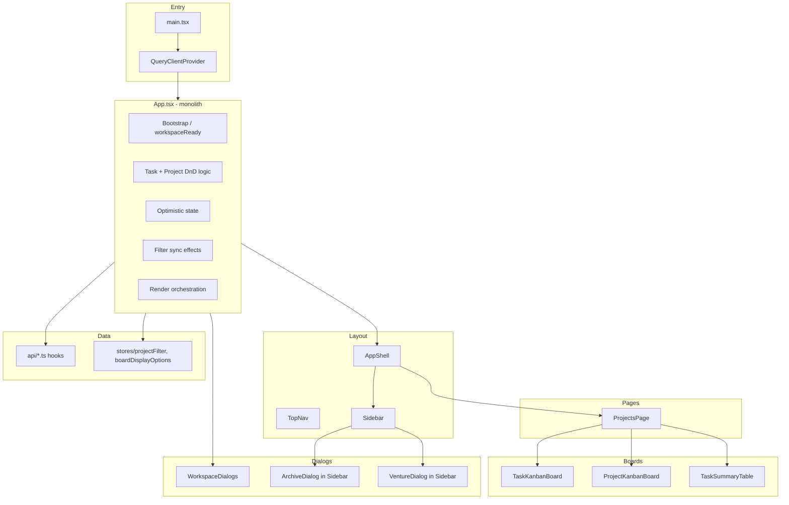
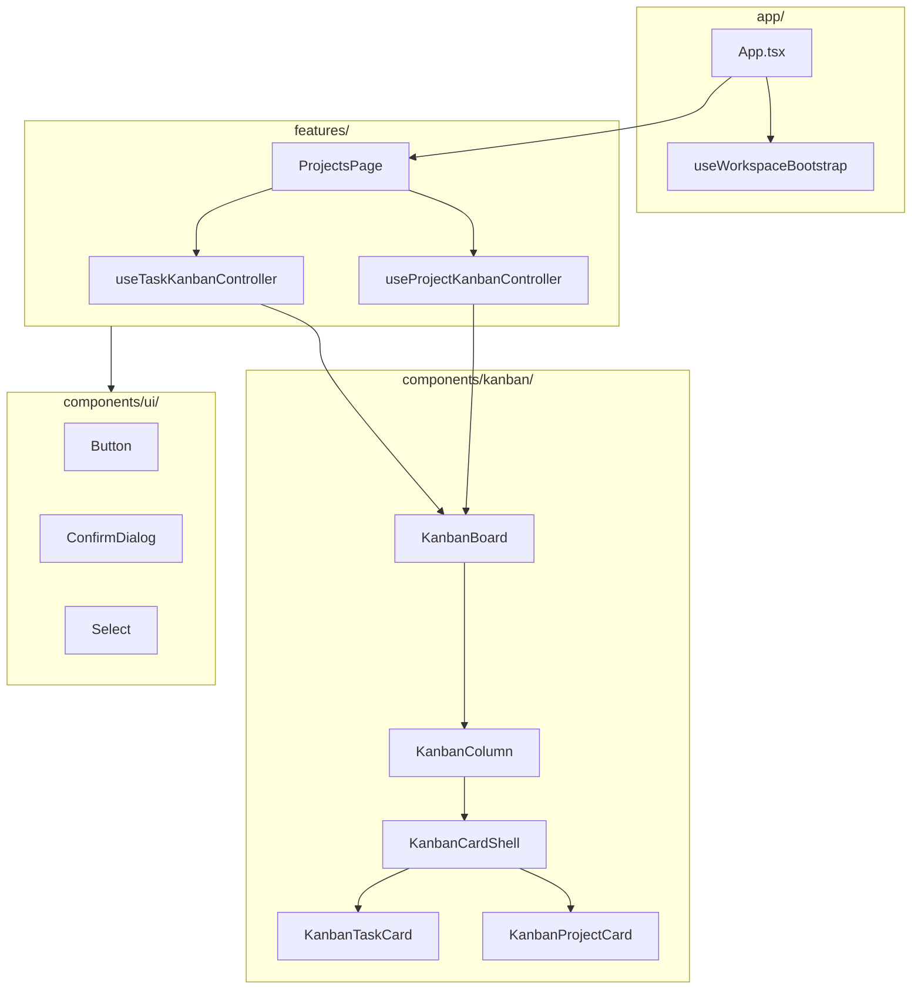
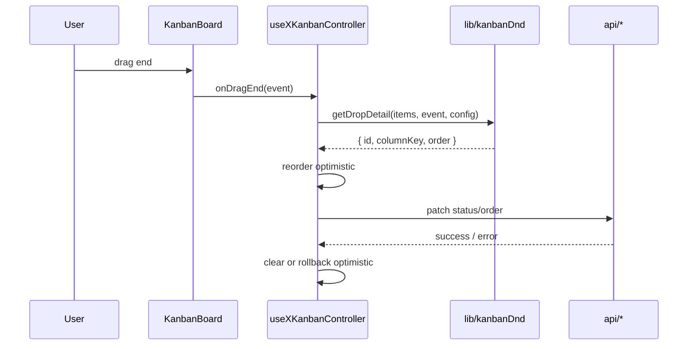

# Frontend Refactor — PRD & TRD

**Status:** `SIGNED OFF` (owner decisions recorded 2026-05-17)  
**Date:** 2026-05-17  
**Author:** Architect Agent  
**Inputs:** `docs/code-review-16-05.md`, `frontend/src/**`, `docs/patterns.md`, `docs/V1-TRD.md` (layer boundaries)  
**Scope:** Structural frontend refactor + approved UX additions (§5.2–5.3). Implementation follows phased PRs below.

---

## Owner decisions (2026-05-17)

| # | Topic | Decision |
|---|--------|----------|
| Q1 | Dialog footer button order | **Pattern A** — primary action on the **right**; Cancel left; destructive (Archive/Delete) **outside** the Save/Cancel pair |
| Q2 | Task archive browser | **Yes** — third tab in `ArchiveDialog` (“Archived tasks”) with **project filter**; restore via confirm (reuse `ConfirmDialog` + `ArchiveList`) |
| Q3 | React Query migration | **No migration during refactor** — keep `useTasks` / `useTaskMutations` as-is while extracting controllers |
| Q4 | `TaskDialog` split | **Separate follow-up epic (D)** — after refactor primitives land: move to `features/tasks/`, split UI subcomponents, co-locate tests; **not** bundled into thin-`App.tsx` PRs |
| Q5 | Styling for new primitives | **Tailwind-first** under `components/ui/*` using CSS variables; kanban/feature surfaces stay on `base.css` semantic classes |
| Q6 | Venture category labels | **Unify** — replace select + “Create label” with `CreatableCombobox` in `VentureDialog` |

**Also approved:** all §5.2 small UX items (footer order, `outline` variant, shared empty state, nested-dialog focus audit).

---

# Product Requirements Document

## 1. Executive summary

The Momentum dashboard frontend works and is well-tested for its size, but **core behaviour is concentrated in a few very large files** — especially `frontend/src/App.tsx` (~1,160 lines) and `frontend/src/components/WorkspaceDialogs.tsx` (~676 lines). Kanban drag-and-drop, optimistic updates, sorting, filter sync, and board orchestration all live in `App.tsx` alongside workspace bootstrap logic. Parallel implementations exist for **task Kanban** and **project Kanban**, for **kanban cards**, for **archive/restore flows**, and for **buttons and selects** (mix of `components/ui/button.tsx`, raw `<button className="secondary-button">`, and undefined `variant="outline"` usage).

**Why refactor:** Faster, safer changes for humans and AI agents; fewer regressions when touching one board or dialog; predictable places to add UI; reduced copy-paste when Phase 2+ screens arrive.

**Problems solved (developer/product engineering):**
- Reviewable, navigable module boundaries instead of scrolling a monolith.
- One obvious home for shared patterns (Kanban shell, confirmation dialog, form select).
- Tests that map to behaviour names (`docs/patterns.md`) instead of ticket IDs.
- Clear “reuse before create” rules for future work.

**What must not change (user perspective):**
- Single-page workspace: sidebar ventures/projects, main area with Tasks/Projects board tabs, task summary table, and existing dialogs.
- Kanban drag-and-drop semantics (column drop, reorder, optimistic feel, error rollback messaging).
- Project filter (sidebar multi-select + toolbar “All projects” / single project).
- Archive and restore flows for ventures and projects; task archive from task dialog; time logs in task edit.
- Visual identity (warm palette, rounded pills, kanban layout) — **no full redesign**; targeted UX per §5.2–5.3 is allowed.

---

## 2. Current frontend problems

### 2.1 Monolithic responsibilities in `App.tsx`

| Responsibility | Approx. location | Notes |
|----------------|------------------|-------|
| Task table sort (`compareTasks`, `sortTasks`) | L73–155 | Could live in `lib/` or `features/tasks/` |
| Task Kanban reorder + optimistic state | L157–343, L896–943 | Duplicated pattern vs project Kanban |
| Task DnD ID parsers + drop detail extraction | L231–343 | Mirrors project Kanban parsers L365–602 |
| Project Kanban reorder + optimistic state | L432–602, L945–1006 | Same algorithms, different types |
| Workspace bootstrap / loading gate | L629–632, L854–877, L1061–1077 | `workspaceReady`, `taskWorkspacePrimed` |
| React Query + custom hooks wiring | L606–765 | `useProjects`, `useTasks`, mutations |
| Filter / sidebar sync effects | L726–852 | Zustand + derived IDs |
| Board tab + type filter state | L635–638, L698–701 | Passed to `ProjectsPage` |
| Render orchestration | L1079–1157 | Shell + page + dialogs |

`App.tsx` is the **integration hub** for everything on the main board; it is not merely routing.

### 2.2 Duplicated UI patterns

| Pattern | Task implementation | Project implementation | Gap |
|---------|---------------------|------------------------|-----|
| Kanban board | `components/TaskKanbanBoard.tsx` | `components/ProjectKanbanBoard.tsx` | Nearly identical `DndContext`, sensors, column shell, empty state |
| Kanban column | Inline `KanbanColumn` in TaskKanbanBoard | Inline `ProjectKanbanColumn` in ProjectKanbanBoard | Same `status-pill`, count, `SortableContext` |
| Kanban card | `kanban/KanbanTaskCard.tsx` | `kanban/KanbanProjectCard.tsx` | Shared sortable shell; different body |
| DnD drop math | `App.tsx` task helpers | `App.tsx` project helpers | ~300 lines duplicated in one file |
| Archive UI | `ArchiveDialog.tsx` (ventures + projects tabs) | Task archive in `TaskDialog` + `WorkspaceDialogs` | No shared restore confirm primitive |
| Creatable select | `ActivityTypeCombobox.tsx` | `VentureDialog` “Create label” + native `<select>` | Two UX models for “pick or create” |
| Gear / menu dropdown | `BoardOptionsMenu.tsx` | `TableSortMenu.tsx` | Same open/close + `role="menu"` pattern |
| Confirmation | Inline `role="alertdialog"` in `ArchiveDialog`, `TaskDialog` | — | No shared `ConfirmDialog` |

### 2.3 Inconsistent component APIs

- **`Button`:** `components/ui/button.tsx` defines `default | ghost | secondary` only; `ArchiveDialog.tsx` uses `variant="outline"` (L400, L426, L452) which is **not** in `buttonVariants` — styling falls through unpredictably.
- **Cancel / destructive actions:** `TaskDialog` uses `Button` + `secondary-button` + `danger-button` classes in different footers (e.g. L586, L708–714, L894–901).
- **Dialogs:** Radix wrapper in `ui/dialog.tsx`; feature dialogs repeat header/close/footer layouts (`ProjectDialog`, `TaskDialog`, `VentureDialog`).
- **Native `<select>`:** Repeated in `ProjectsPage.tsx`, `ProjectDialog.tsx`, `TaskDialog.tsx`, `VentureDialog.tsx` with `className="field"` but no shared `Select` component.

### 2.4 Inconsistent styling

- **Design tokens** in `styles/tokens.css`; **most layout** in `styles/base.css` (~1,408 lines) with semantic classes (`.kanban-column`, `.task-card`, `.danger-button`).
- **Tailwind** used sporadically (e.g. `ActivityTypeCombobox` list uses `bg-white`, `border-slate-300`; app shell uses CSS variables).
- **Duplicate CSS blocks** for `.danger-button` in `base.css` (reported in code review grep ~L694 and ~L802).

### 2.5 Risky state / data coupling

- **Optimistic Kanban** (`optimisticTasks`, `optimisticProjects`) owned in `App.tsx` with reset effects tied to query data and filter keys — easy to break when extracting.
- **`locallyArchivedProjectIds`** in `App` + archive side effects in `WorkspaceDialogs` — cross-cutting optimistic UX for project archive.
- **Mixed data libraries:** TanStack Query for project board mutation; custom `useProjects` / `useTasks` hooks in `api/*.ts` (not uniform React Query).
- **Test hooks:** `kanban:drop` and `project-kanban:drop` custom events on board ref (L1008–1046) — must be preserved for tests.

### 2.6 Hard-to-test areas

- 32 test files; many named `App.1b*.test.tsx`, `phase-1-6-*.test.tsx` (contradicts `docs/patterns.md`).
- Heavy integration tests render full `App` via `test/renderApp.tsx`.
- DnD and optimistic paths tested indirectly through DOM and custom events.

### 2.7 Accessibility / UX consistency

**Strengths:** Board tabs use `role="tablist"`; kanban columns have `aria-label`; archive dialog uses tabs and `alertdialog` for restore; combobox uses `role="combobox"` / `listbox`.

**Gaps:**
- Icon-only controls rely on `aria-label` inconsistently (gear vs table sort).
- Multiple dialog footers with different button order (Radix `DialogFooter` vs custom `task-dialog-footer`).
- `TaskDialog` create mode still uses raw `secondary-button` while edit mode uses `Button` — keyboard/focus parity should be verified after unification.

---

## 3. Goals

1. **Decompose `App.tsx`** into application shell, workspace controller hook(s), and feature-level view composition — target **&lt; 200 lines** in `App.tsx` (orchestration only).
2. **Introduce a small internal component library** under `components/ui/` and `components/kanban/` (and `components/feedback/`) with documented props.
3. **Standardize** Kanban board/column/card shell, archive list + restore confirm, modal footer actions, and form controls.
4. **Improve agent/human readability:** predictable folders (`features/`, `hooks/`, `lib/`), behaviour-named tests, index of reusable primitives.
5. **Reduce duplicated logic** — one generic Kanban DnD helper parameterized by column key; shared sort/reorder utilities already partially in `lib/kanbanSort.ts`.
6. **Safer future changes** — feature work touches `features/tasks` or `features/projects`, not `App.tsx` by default.

---

## 4. Non-goals

| Non-goal | Rationale |
|----------|-----------|
| Full visual redesign | Refactor preserves current look unless owner approves UX tweaks |
| Backend API rewrite | DELETE-as-archive, status codes, etc. are separate (see code review) |
| Database / schema changes | Not required for UI extraction |
| Migrate `useTasks` / `useTaskMutations` to React Query | Owner decision Q3: defer; optional separate epic later |
| Add `react-router` | Current tab model is intentional single-view |
| Storybook / Chromatic | Not present today; optional Phase 7+ |
| Auth UI | No auth in app today |
| Splitting `TaskDialog` UI inside refactor epic | **Follow-up epic (Q4)** — logic may move in Phase 6; UI decomposition is out of scope for Phases 0–7 |
| Hard-delete / purge UI for tasks | Not in scope |

---

## 5. Proposed user-facing behaviour

### 5.1 Unchanged (must preserve)

- Sidebar: ventures, expand/collapse, project checkboxes, create venture/project, **View archive** entry.
- Main toolbar: Tasks / Projects tabs; project filter select; project type filter on Projects tab; **+ New task**.
- Task Kanban: four columns (Backlog → Done); board options gear; drag reorder and cross-column moves.
- Project Kanban: four columns (Idea → Shipped); drag; open project on title click.
- Task summary table: sort via gear menu; row actions open task edit.
- Dialogs: create/edit project, create/edit task, venture dialog, archive dialog (venture + project tabs today), time log sub-dialogs, activity type management.
- Loading gate: “Loading workspace…” until bootstrap completes.
- Error strings: form-level and kanban mutation banners as today.

### 5.2 Small UX improvements — **approved**

| Improvement | Status |
|-------------|--------|
| Unify cancel/save to **Pattern A** (primary right) via `DialogFormFooter` | Approved (Q1) |
| Implement `outline` + `destructive` Button variants; retire ad-hoc classes in touched files | Approved |
| Shared `EmptyState` component | Approved |
| Focus trap audit on nested dialogs (task → time log) | Approved |

### 5.3 New user-facing behaviour — **approved**

| Change | Detail |
|--------|--------|
| **Archived tasks tab** | Third tab in **Archive** dialog alongside ventures and projects |
| **Project filter on archived tasks** | Filter archived task list by project (e.g. `Select` — “All projects” + active projects); uses `GET /api/v1/tasks?status=archived` with optional `project_id` (existing query params in `api/tasks.ts`) |
| **Restore archived task** | Row action → `ConfirmDialog` → patch task status back to a kanban status (e.g. `backlog`); hide tasks whose parent project is archived (mirror project-restore guard pattern) |
| **Venture category label** | Single `CreatableCombobox` instead of select + separate “Create label” field (Q6) |
| **Dialog footers** | Venture/project/task/time-log dialogs adopt Pattern A where they use Save/Cancel |

**Still archive-from-task-dialog:** Edit task → Archive remains; archive tab is for **browse + restore**, not replacing inline archive.

---

## 6. Component library requirements

Convention: **UI primitives** = no domain types; **Kanban** = generic shells; **Feature adapters** = wire domain data.

### 6.1 Summary table

| Component | Purpose | Reuse targets |
|-----------|---------|---------------|
| `Button` / `IconButton` | Actions | All dialogs, toolbar, cards, archive |
| `Modal` / `Dialog` stack | Radix wrapper + layout slots | All feature dialogs |
| `Select` | Native-styled labeled select | Toolbar filters, forms |
| `CreatableCombobox` | Filter + pick + inline create | Activity type; venture category label (Q6) |
| `DialogFormFooter` | Pattern A Save/Cancel layout | All entity + confirm dialogs |
| `KanbanBoard` | DndContext + grid + sensors | Task + project boards |
| `KanbanColumn` | Droppable column shell | Both boards |
| `KanbanCardShell` | Sortable `li` + drag chrome | Task + project cards |
| `ArchiveList` | Tabbed or single list of archived rows | `ArchiveDialog` (ventures, projects, **tasks**) |
| `ConfirmDialog` | alertdialog pattern | Restore, delete time log |
| `EmptyState` | Muted guidance | Kanban columns, archive tabs |
| `LoadingState` / `ErrorBanner` | Feedback | Boards, queries |
| `FormField` | Label + control + error | All forms |
| `StatusPill` | Column/status badge | Kanban headers, task metrics |
| `ActionMenu` | Gear-triggered menu | Board options, table sort |

### 6.2 Component specifications

#### `Button` / `IconButton`

- **Purpose:** Single action surface; replace `secondary-button`, `danger-button`, and ad-hoc classes.
- **Variants:** `default` (primary), `secondary`, `ghost`, `destructive`, `outline` (required — implement in CVA).
- **Sizes:** `default`, `sm`, `icon` (existing).
- **Props (sketch):** `variant`, `size`, `disabled`, `type`, `onClick`, `aria-label` (required when children are icon-only).
- **Reuse:** `ArchiveDialog`, `ProjectDialog`, `TaskDialog`, `VentureDialog`, `ProjectsPage`, `Sidebar`, kanban cards (title is separate link-styled control).
- **a11y:** Visible focus ring (existing); destructive actions labeled clearly (“Archive project”, not “Delete”).
- **Styling:** CVA + CSS variables from `tokens.css`; migrate `.danger-button` rules into `destructive` variant.

#### `DialogFormFooter` (new)

- **Purpose:** Enforce **Pattern A** (Q1): `[Cancel] [Primary]` with primary on the **right** on `sm+`; destructive actions **not** in this row.
- **Props:** `onCancel`, `cancelLabel?`, `primaryLabel`, `onPrimary` / `submit`, `pending?`, `primaryDisabled?`.
- **Reuse:** `ProjectDialog`, `VentureDialog`, `TaskDialog`, time-log dialog, restore confirms after `ConfirmDialog` migration.

#### `Dialog` (extend `components/ui/dialog.tsx`)

- **Purpose:** Consistent modal chrome.
- **Variants:** `default`, `alert` (for confirm).
- **Props:** Existing Radix + optional `size`, `onBackdropClick`.
- **Reuse:** All modals; compose with `DialogFormFooter` or `ConfirmDialog`.
- **a11y:** Focus trap via Radix; `aria-describedby` when description exists.

#### `Select`

- **Purpose:** Labeled `<select>` with `field` / `field-error` wiring.
- **Props:** `label`, `options: { value, label }[]`, `value`, `onChange`, `error`, `disabled`, `aria-label`.
- **Reuse:** `ProjectsPage` filters, `ProjectDialog`, `TaskDialog`, `VentureDialog`.
- **a11y:** Associated `<label>` or `aria-label`; error linked via `aria-describedby`.

#### `CreatableCombobox`

- **Purpose:** Generalize `ActivityTypeCombobox` pattern.
- **Props:** `items`, `filterText`, `onFilterChange`, `onSelect`, `onCreate`, `createLabel`, `renderOption`, `error`, `disabled`.
- **Reuse:** Activity types (time logs); **venture category label** in `VentureDialog` (Q6 — replaces `<select>` + “Create label” block).
- **a11y:** Match existing combobox roles; keyboard: Escape closes list.
- **UX note:** Venture create/edit should still make “type to create category” discoverable (placeholder/copy review in implementation).

#### `KanbanBoard`

- **Purpose:** Shared `DndContext`, sensors (`distance: 8`), `closestCorners`, grid wrapper, error/loading slots.
- **Props:** `columns: ColumnConfig[]`, `itemsByColumn`, `renderColumn`, `renderCard`, `onDragEnd`, `disabled`, `boardRef`, `mutationError`, `emptySelectionMessage`.
- **Reuse:** `TaskKanbanBoard`, `ProjectKanbanBoard` become thin wrappers.

#### `KanbanColumn`

- **Purpose:** Column chrome: title pill, count, droppable ref, sortable list, empty state.
- **Props:** `columnId`, `title`, `statusClassName`, `count`, `itemIds`, `children`, `isOver`, `disabled`.

#### `KanbanCardShell`

- **Purpose:** Sortable list item with drag transform and shared padding/classes.
- **Props:** `id`, `draggingDisabled`, `onOpen?`, `children`, `className`.
- **Reuse:** Wrap `KanbanTaskCard` / `KanbanProjectCard` body content.

#### `ArchiveList` + `ArchiveRow`

- **Purpose:** Tabbed or filtered list with restore/detail actions.
- **Props:** `items`, `onRestore`, `onOpenDetail`, `renderMeta`, `emptyMessage`.
- **Reuse:** `ArchiveDialog` venture/project tabs.

#### `ConfirmDialog`

- **Purpose:** Replace inline alertdialog blocks.
- **Props:** `open`, `title`, `description`, `confirmLabel`, `cancelLabel`, `variant: 'default' | 'destructive'`, `onConfirm`, `pending`.
- **Reuse:** Archive restore, time log delete, any future destructive action.

#### `EmptyState`, `LoadingState`, `ErrorBanner`

- **Purpose:** Consistent copy containers (`muted-copy`, `form-error`).
- **Reuse:** Kanban, archive, queries.

#### `FormField`

- **Purpose:** `<label>` + control + `field-error`.
- **Reuse:** Extract repeated `label.field` pattern from dialogs.

#### `StatusPill`

- **Purpose:** `status-pill status-{status}` wrapper.
- **Props:** `status`, `label`, optional `className`.

#### `ActionMenu`

- **Purpose:** Extract from `BoardOptionsMenu` / `TableSortMenu`.
- **Props:** `trigger`, `items`, `aria-label`.

---

## 7. Feature module requirements

```
features/
  workspace/     # bootstrap, ready gate, board tab state
  projects/      # project kanban controller, project dialog wiring
  tasks/         # task kanban controller, table sort, task dialog wiring
  archives/      # archive dialog + restore flows
  ventures/      # sidebar venture tree (optional split from layout)
```

| Module | Stays feature-specific | Moves to shared |
|--------|------------------------|-----------------|
| **workspace** | Bootstrap timing, `boardViewTab`, wiring shell props | Loading UI, error banner |
| **projects** | Project type filter, board status columns, `openTaskCounts`, archive+shipped payload | Kanban shell, card adapter, reorder hook |
| **tasks** | Task sort keys, table columns, status columns, time logs | Kanban shell, card adapter, reorder hook |
| **archives** | Venture / project / **task** tabs; task **project filter**; parent-project restore guards; restore → kanban status | Confirm dialog, `ArchiveList`, `Select` filter, `listTasks({ status: 'archived', projectId? })` |
| **layout** (existing) | `AppShell`, `Sidebar`, `TopNav` | Archive trigger placement |

**`WorkspaceDialogs.tsx`:** Split into `features/projects/projectDialogController.ts` + `features/tasks/taskDialogController.ts` (hooks returning dialog elements), not one 676-line hook.

**API layer:** Keep `frontend/src/api/*` as today; feature hooks call `useTaskMutations`, `useProjects`, etc.

---

## 8. Success metrics

| Metric | Target |
|--------|--------|
| `App.tsx` line count | ≤ 200 (orchestration only) |
| Largest file | No file &gt; 500 lines without documented exception |
| Folder structure | `features/`, `components/ui/`, `components/kanban/` documented in this file |
| Duplicated DnD helpers | Single generic module used by task + project |
| Button class ad-hoc usage | Zero new `secondary-button` / `danger-button` in touched files |
| Tests | `make test` + `npx tsc --noEmit` pass after each phase |
| Manual QA | Checklist in TRD §7 completed before merge to `main` |
| Agent onboarding | `docs/frontend-refactor-prd-trd.md` + `components/ui/README` (optional Phase 7) |

---

# Technical Requirements Document

## 1. Current architecture assessment

### 1.1 Entry points

| File | Role |
|------|------|
| `frontend/src/main.tsx` | `QueryClientProvider` + `App` + global CSS |
| `frontend/src/App.tsx` | Workspace root |
| `frontend/index.html` | Vite mount |

No router — **view selection** = `boardViewTab: 'tasks' | 'projects'` in `App.tsx` (L635, L1079–1108).

### 1.2 Current structure (high level)



### 1.3 `App.tsx` responsibility map

| Lines (approx.) | Concern |
|-----------------|---------|
| 1–71 | Imports, constants |
| 73–343 | Task sort + Kanban reorder + drop parsing |
| 345–602 | Project Kanban reorder + drop parsing |
| 604–878 | State, queries, effects, workspace bootstrap |
| 880–1006 | Kanban handlers + mutations |
| 1008–1046 | Test-only custom events |
| 1048–1157 | Derived labels + JSX |

### 1.4 Existing components (inventory)

| Path | Lines | Notes |
|------|-------|-------|
| `components/TaskDialog.tsx` | 918 | Create/edit + time logs + nested dialogs |
| `components/WorkspaceDialogs.tsx` | 676 | Project/task dialog controllers |
| `components/ArchiveDialog.tsx` | 483 | Archive browser |
| `components/layout/Sidebar.tsx` | 330 | Venture tree + archive entry |
| `components/ProjectKanbanBoard.tsx` | 189 | Task board twin |
| `components/TaskKanbanBoard.tsx` | 193 | Includes `BoardOptionsMenu` |
| `components/ProjectDialog.tsx` | 244 | |
| `components/kanban/KanbanTaskCard.tsx` | 104 | |
| `components/kanban/KanbanProjectCard.tsx` | 82 | |
| `components/ui/button.tsx` | 50 | Partial design system |
| `components/ui/dialog.tsx` | 100 | Radix wrapper |
| `components/ui/checkbox.tsx` | small | Used in sidebar + board options |
| `pages/ProjectsPage.tsx` | 126 | Toolbar + slots for kanban/table |

### 1.5 State ownership

| State | Owner | Persistence |
|-------|-------|-------------|
| Sidebar project selection | `stores/projectFilter.ts` (Zustand) | `localStorage` |
| Board display toggles | `stores/boardDisplayOptions.ts` | `localStorage` |
| Board tab, type filter, sort, dialog modes | `App.tsx` / `WorkspaceDialogs` | Session |
| Optimistic kanban | `App.tsx` | Ephemeral |
| Dialog form state | `WorkspaceDialogs` | Ephemeral |
| Server data | `api/*` custom hooks + one React Query mutation for project board | Server |

### 1.6 Data fetching

- **Pattern:** Custom hooks (`useProjects`, `useTasks`, `useVentures`) wrapping `apiRequest` + manual `reload()` — not full React Query suite.
- **Exception:** `updateProjectBoardStatusMutation` in `App.tsx` (TanStack `useMutation`).
- **Types:** `api/types.ts` — domain types aligned with backend.
- **Test support:** `test/workspaceBackendMock.ts`, `renderApp.tsx`, `workspaceQueries.ts`.

### 1.7 Styling

- `styles/tokens.css` — CSS variables (`--accent-action`, surfaces).
- `styles/base.css` — majority of layout/kanban/dialog rules.
- Tailwind 4 via Vite plugin — **Q5:** new `components/ui/*` use Tailwind + CSS variables; avoid unrelated slate utility palettes.
- `lib/utils.ts` — `cn()` for shadcn-style merges.
- **Rule:** Kanban/archive/feature layout stays on `base.css` classes in Phases 0–7 unless a PR explicitly migrates them.

### 1.8 Duplication hotspots (priority order)

1. `App.tsx` task vs project Kanban DnD (~300 lines)
2. `TaskKanbanBoard` vs `ProjectKanbanBoard` column/board (~150 lines parallel)
3. `KanbanTaskCard` vs `KanbanProjectCard` sortable shell
4. Confirm alertdialog markup (archive restore, time log delete)
5. Native `<select>` fields (6+ instances)
6. Button styling (`Button` vs CSS classes)
7. `BoardOptionsMenu` vs `TableSortMenu`

### 1.9 Tests

- **32** `*.test.*` files under `frontend/src/`.
- Many **`App.*` / `phase-1-6-*`** names — rename incrementally per `docs/patterns.md`.
- **No Storybook.**
- Coverage threshold: ≥ 70% (`AGENTS.md`).

---

## 2. Target architecture

Adjusted to fit repo (Vite, no router, existing `pages/` and `components/`):

```
frontend/src/
  main.tsx
  app/
    App.tsx                    # thin composer
    WorkspaceRoot.tsx          # optional: shell + ready gate
  features/
    workspace/
      useWorkspaceBootstrap.ts
      useBoardViewTab.ts
    tasks/
      useTaskKanbanController.ts
      useTaskTableSort.ts
      TaskBoardView.tsx        # composes TaskKanbanBoard + table
    projects/
      useProjectKanbanController.ts
      ProjectBoardView.tsx
    archives/
      ArchiveDialog.tsx        # moved from components/ (or re-export)
  pages/
    ProjectsPage.tsx           # unchanged role
  components/
    layout/                    # AppShell, Sidebar, TopNav
    ui/                        # Button, Dialog, Select, FormField, ConfirmDialog...
    kanban/                    # KanbanBoard, KanbanColumn, KanbanCardShell, cards
    feedback/                  # EmptyState, ErrorBanner, LoadingState
  hooks/                       # cross-feature if needed
  lib/
    kanbanSort.ts              # existing
    kanbanDnd.ts               # NEW: generic drop detail + reorder
  api/                         # unchanged
  stores/                      # unchanged
  styles/
  test/
  types/                       # optional: ui.ts for shared UI types
```

### Target component diagram



### Shared Kanban abstraction



---

## 3. Decomposition plan for `App.tsx`

| Extracted unit | Proposed path | Responsibility | Dependencies | Migration notes | Risk |
|----------------|---------------|----------------|--------------|-----------------|------|
| Task table sort | `features/tasks/taskTableSort.ts` | `compareTasks`, `sortTasks`, types | `Task`, `Project`, `TaskSortState` | Pure functions — move first | **Low** |
| Task Kanban DnD | `lib/kanbanDnd/taskKanban.ts` or generic | Parsers, reorder, drop detail | `@dnd-kit`, `kanbanSort` | Keep test event contract | **High** |
| Project Kanban DnD | `lib/kanbanDnd/projectKanban.ts` | Same for projects | board status types | Share generic core | **High** |
| Task kanban controller | `features/tasks/useTaskKanbanController.ts` | optimistic state, handlers, errors | `useTaskMutations`, DnD lib | Pass `boardRef` for tests | **High** |
| Project kanban controller | `features/projects/useProjectKanbanController.ts` | optimistic + mutation queue | `updateProjectBoardStatus`, DnD lib | Preserve `enqueueProjectBoardLane` | **High** |
| Workspace bootstrap | `features/workspace/useWorkspaceBootstrap.ts` | ready gate, task priming | `useProjects`, `useTasks` | Loading UI unchanged | **Medium** |
| Filter sync effects | `features/workspace/useProjectFilterSync.ts` | toolbar/sidebar sync | Zustand store | Careful with localStorage | **Medium** |
| Board tab state | `features/workspace/useBoardViewTab.ts` or keep in App | `boardViewTab`, type filter | — | trivial | **Low** |
| Open task counts | `features/projects/openTaskCounts.ts` | memoized counts | tasks query data | Pure derivation | **Low** |
| Composer | `app/App.tsx` | Wire shell + page + hooks | all above | Final step | **Medium** |

**`WorkspaceDialogs.tsx` decomposition (parallel track):**

| Piece | Path | Risk |
|-------|------|------|
| Project form + archive handlers | `features/projects/useProjectDialog.ts` | Medium |
| Task form + archive + time logs | `features/tasks/useTaskDialog.ts` | High (918-line `TaskDialog` UI stays; logic moves) |
| Render bundle | `features/workspace/WorkspaceDialogs.tsx` | Low |

---

## 4. Reusable component design

### 4.1 `lib/kanbanDnd.ts` (generic)

```typescript
export type KanbanColumnKey = string

export type KanbanDndConfig<TItem extends { id: string }> = {
  columnIdPrefix: string
  cardIdPrefix: string
  getColumnKey: (item: TItem) => KanbanColumnKey
  getOrder: (item: TItem) => number | null
  setColumnAndOrder: (item: TItem, column: KanbanColumnKey, order: number | null) => TItem
  orderItemsInColumn: (items: TItem[], column: KanbanColumnKey) => TItem[]
}

export type DropDetail = {
  itemId: string
  columnKey: KanbanColumnKey
  kanban_order: number | null
}

export function getDropDetailFromDragEvent<TItem>(
  items: TItem[],
  event: DragEndEvent,
  config: KanbanDndConfig<TItem>,
): DropDetail | null

export function reorderKanbanItems<TItem>(...): TItem[]
export function hasKanbanComparableChanged<TItem>(...): boolean
```

**Migrate from:** `App.tsx` L157–343 and L432–602.  
**Edge cases:** Drop on column vs card; no-op when order unchanged; `completed_date` cleared when task leaves `done`; project `finished` when `shipped`.

### 4.2 `components/kanban/KanbanBoard.tsx`

```typescript
export type KanbanBoardProps<TColumn extends string> = {
  boardRef?: RefObject<HTMLDivElement>
  columns: Array<{ key: TColumn; title: string; statusClass: string }>
  disabled?: boolean
  mutationError?: string | null
  loading?: boolean
  loadingMessage?: string
  emptySelectionMessage?: string | null
  onDragEnd: (event: DragEndEvent) => void
  renderColumn: (column: TColumn) => ReactNode
}
```

**Migrate from:** duplicated `DndContext` blocks in `TaskKanbanBoard.tsx` / `ProjectKanbanBoard.tsx`.

### 4.3 `components/kanban/KanbanCardShell.tsx`

```typescript
export type KanbanCardShellProps = {
  sortableId: string
  draggingDisabled: boolean
  className?: string
  children: ReactNode
  dragData: Record<string, unknown>
}
```

**Migrate from:** shared `useSortable` setup in `KanbanTaskCard` / `KanbanProjectCard`.

### 4.4 `KanbanTaskCard` / `KanbanProjectCard` (adapters)

Keep as feature-specific bodies inside shell; props largely unchanged.

### 4.5 `components/ui/button.tsx` (extend)

Add variants:

```typescript
variant: {
  // existing default, ghost, secondary
  destructive: '...', // from .danger-button
  outline: '...',     // fix ArchiveDialog usage
}
```

Deprecate direct `.secondary-button` / `.danger-button` in touched files.

### 4.6 `components/ui/Select.tsx`

```typescript
export type SelectOption = { value: string; label: string }
export type SelectProps = {
  label?: string
  'aria-label'?: string
  value: string
  options: SelectOption[]
  onChange: (value: string) => void
  error?: string
  disabled?: boolean
  className?: string
}
```

### 4.7 `components/ui/CreatableCombobox.tsx`

Generalize from `ActivityTypeCombobox.tsx` — keep activity-type formatting as `renderOption` prop.

### 4.8 `components/ui/ConfirmDialog.tsx`

```typescript
export type ConfirmDialogProps = {
  open: boolean
  onOpenChange: (open: boolean) => void
  title: string
  description?: string
  confirmLabel: string
  cancelLabel?: string
  tone?: 'default' | 'destructive'
  pending?: boolean
  onConfirm: () => void | Promise<void>
}
```

**Migrate from:** `ArchiveDialog.tsx` L434–465, `TaskDialog.tsx` alertdialog block ~L880.

### 4.9 `components/ui/DialogFormFooter.tsx`

Standardize primary/cancel/destructive placement per product decision (document in component).

### 4.10 `features/archives/ArchiveList.tsx`

Extract tab panels from `ArchiveDialog` — row rendering, restore button, detail drill-in.

**Edge cases:** Parent venture archived → project restore blocked (copy from tests in `Project.phase-1-6-9.test.tsx`); stale list on reopen (see `App.1b6.test.tsx`).

---

## 5. Data and state plan

| Concern | Recommendation |
|---------|----------------|
| **Global client state** | Keep Zustand stores; do not add Redux |
| **Server state** | Keep `api/*` hooks **unchanged** (Q3: no `useTasks` → React Query in this epic); archived tasks tab calls existing `listTasks` / task update APIs |
| **Optimistic Kanban** | Colocate in `useTaskKanbanController` / `useProjectKanbanController`; expose `{ displayItems, onDragEnd, error, isDisabled }` |
| **Project vs task modelling** | Generic `kanbanDnd` config objects; domain types stay in `api/types.ts` |
| **Drag state** | `@dnd-kit` local to `KanbanBoard`; no global DnD store |
| **Archive/restore** | Shared `ConfirmDialog` + `performUnarchive*` helpers in `features/archives/api.ts` thin wrapper |
| **API from UI** | Feature hooks call `api/*`; presentational components receive callbacks only |
| **Test hooks** | `kanban:drop` / `project-kanban:drop` remain on `boardRef` — document in `kanbanDnd` test section |

**`locallyArchivedProjectIds`:** Move with project archive handler into `useProjectDialog` or `features/projects/archiveOptimistic.ts` — document coupling to sidebar filter reset.

---

## 6. TypeScript / interface plan

| Area | Location | Notes |
|------|----------|-------|
| Domain | `api/types.ts` | No breaking changes |
| UI shared | `types/ui.ts` (new, optional) | `SelectOption`, `MenuItem` |
| Kanban generic | `lib/kanbanDnd.ts` | `KanbanDndConfig<TItem>` |
| Sort state | `features/tasks/taskTableSort.ts` | Move `TaskSortKey`, `TaskSortState` from `TaskSummaryTable.tsx` |
| Dialog modes | feature hooks | `ProjectDialogMode`, `TaskDialogMode` stay near hooks |
| Button variants | `components/ui/button.tsx` | `VariantProps<typeof buttonVariants>` |

**Strict mode:** No `any`; all new exports typed. Fix `variant="outline"` by adding variant or removing invalid prop.

---

## 7. Testing and QA plan

### 7.1 Unit / component tests

| Area | Approach |
|------|----------|
| `lib/kanbanDnd` | Pure function tests — drop positions, no-op, rebalance |
| `taskTableSort` | Sort comparators with fixtures from `test/fixtures.ts` |
| `Button`, `ConfirmDialog`, `Select` | RTL shallow render + a11y roles |
| Kanban shells | Optional — rely on integration if time-boxed |

### 7.2 Integration tests (keep green)

- Existing `renderApp()` flows remain primary safety net.
- When moving DnD, **do not remove** custom event listeners until tests updated to call controller directly.
- Rename tests when touching files: `App.kanban-drag.test.tsx` not `App.1b4.test.tsx`.

### 7.3 Manual QA checklist

- [ ] Cold load → workspace appears; sidebar populated.
- [ ] Sidebar: select/deselect projects; toolbar filter sync.
- [ ] Tasks board: drag within column, across columns, error banner on API failure.
- [ ] Projects board: drag; shipped sets finished; type filter.
- [ ] Board options gear toggles card fields.
- [ ] Table sort gear: all sort keys.
- [ ] Create/edit/archive project; shipped-on-archive checkbox.
- [ ] Create/edit/archive task; time log add/edit/delete; activity type create inline.
- [ ] Archive dialog: venture, project, and **task** tabs; project filter on tasks tab; restore confirm; blocked restore when parent venture/project archived.
- [ ] Venture create/edit/archive in sidebar.
- [ ] Keyboard: dialog Escape, focus return.

### 7.4 Regression risks

| Risk | Mitigation |
|------|------------|
| Optimistic desync | Characterization tests before extract; compare snapshots of order |
| Filter + optimistic race | Keep existing `useEffect` reset rules in controller |
| Test event breakage | Phase 3 acceptance includes full `make test` |
| Button visual drift | Screenshot optional; compare CSS computed styles for destructive |

### 7.5 Accessibility checks

- axe or manual: confirm dialogs, combobox, tab lists.
- Verify `aria-label` on icon buttons after `ActionMenu` extraction.

---

## 8. Migration plan

### Phase 0: Baseline and safety checks

- **Goal:** Lock green baseline; document line counts.
- **Files:** None (run commands only).
- **Steps:** `make lint`, `make test`, record coverage; tag commit hash in PR description.
- **Acceptance:** All gates pass.
- **Risks:** None.
- **Rollback:** N/A.

### Phase 1: Extract constants, types, and utilities

- **Goal:** Shrink `App.tsx` without behaviour change.
- **Files:** `features/tasks/taskTableSort.ts`, move types from `TaskSummaryTable.tsx`; optional `lib/kanban/constants.ts` for ID prefixes.
- **Steps:** Move pure functions; re-export; update imports; run tests.
- **Acceptance:** `App.tsx` −150 lines; zero diff in runtime behaviour.
- **Risks:** Low.
- **Rollback:** Revert single PR.

### Phase 2: Extract shared UI primitives

- **Goal:** Button variants (`outline`, `destructive`), `DialogFormFooter` (Pattern A), `Select`, `ConfirmDialog`, `FormField`, `ErrorBanner`, `EmptyState`; Tailwind-first under `components/ui/` (Q5).
- **Files:** `components/ui/*`, migrate `ArchiveDialog` outline buttons; pilot Pattern A on one entity dialog footer.
- **Steps:** Extend CVA; replace one usage at a time; visual check.
- **Acceptance:** No invalid `variant`; `tsc` clean.
- **Risks:** Visual regression.
- **Rollback:** Revert UI PR (isolated).

### Phase 3: Extract Kanban abstractions

- **Goal:** `lib/kanbanDnd.ts`, `KanbanBoard`, `KanbanColumn`, `KanbanCardShell`; thin task/project boards.
- **Files:** `lib/kanbanDnd.ts`, `components/kanban/*`, `TaskKanbanBoard.tsx`, `ProjectKanbanBoard.tsx`, **still keep handlers in App** initially OR move in same PR with tests.
- **Steps:** (1) Add lib tests (2) Move DnD pure logic (3) Refactor boards (4) Wire App to lib.
- **Acceptance:** All kanban tests pass; custom events still work.
- **Risks:** **High** — core interaction.
- **Rollback:** Revert phase branch; keep Phase 0 tag.

### Phase 4: Extract feature modules (controllers)

- **Goal:** `useTaskKanbanController`, `useProjectKanbanController`, `useWorkspaceBootstrap`, filter sync hook.
- **Files:** `features/**`, `App.tsx`.
- **Steps:** Move optimistic state + handlers; leave JSX composition in App or `WorkspaceRoot`.
- **Acceptance:** `App.tsx` &lt; 400 lines.
- **Risks:** High.
- **Rollback:** Revert feature PR.

### Phase 5: Extract archive patterns + archived tasks tab

- **Goal:** `ConfirmDialog` + `ArchiveList`; slim `ArchiveDialog`; **new “Archived tasks” tab** with project filter and restore (Q2).
- **Files:** `ArchiveDialog.tsx`, `features/archives/*`, `api/tasks.ts` (use existing filters only — no backend change expected).
- **Steps:** (1) Shared list/confirm (2) Refactor venture/project tabs (3) Add tasks tab + `Select` project filter (4) Restore handler + guards (archived parent project).
- **Acceptance:** Existing archive tests pass; new tests for tasks tab list/filter/restore; manual QA §7.3 archive section extended.
- **Risks:** Medium–high (new product surface).
- **Rollback:** Revert archive PR; tasks tab can be feature-flagged if needed.

### Phase 6: Simplify `App.tsx` + `WorkspaceDialogs`

- **Goal:** Target orchestration-only `App.tsx`; split `WorkspaceDialogs`.
- **Files:** `app/App.tsx`, `features/workspace/WorkspaceDialogs.tsx`, `features/projects/useProjectDialog.ts`, `features/tasks/useTaskDialog.ts`.
- **Acceptance:** `App.tsx` ≤ 200 lines; `WorkspaceDialogs` ≤ 200 lines composer.
- **Risks:** Medium.
- **Rollback:** Revert.

### Phase 7: Tests, cleanup, documentation

- **Goal:** Rename tests; remove dead CSS classes; add `components/ui/README.md`; document styling rule (Q5).
- **Files:** `**/*.test.tsx`, `styles/base.css`, `docs/frontend-refactor-prd-trd.md`.
- **Acceptance:** Naming aligns with `docs/patterns.md`; no duplicate `.danger-button` blocks.
- **Risks:** Low tedium.
- **Rollback:** N/A.

### Follow-up epic (post Phase 7): `TaskDialog` module decomposition (Q4-D)

- **Goal:** Move `TaskDialog` to `features/tasks/`; split into `TaskCreateForm`, `TaskEditForm`, `TaskTimeLogsPanel`, `TimeLogFormDialog`, thin composer; co-locate behaviour tests.
- **Prerequisite:** Phases 2–3 primitives (`ConfirmDialog`, `FormField`, `CreatableCombobox`) merged.
- **Not a gate** for marking refactor epic complete — track separately in backlog.

---

## 9. Suggested PR breakdown

| PR | Title (suggested) | Phase | Est. size |
|----|-------------------|-------|-----------|
| 1 | `chore(frontend): baseline metrics for refactor` | 0 | Tiny |
| 2 | `refactor(frontend): extract task table sort utilities` | 1 | Small |
| 3 | `feat(ui): extend Button variants and add Select` | 2 | Medium |
| 4 | `feat(ui): add ConfirmDialog and FormField` | 2 | Medium |
| 5 | `refactor(frontend): generic kanbanDnd library with tests` | 3 | Medium |
| 6 | `refactor(frontend): shared KanbanBoard shell` | 3 | Medium |
| 7 | `refactor(frontend): wire task kanban to kanbanDnd` | 3 | Large |
| 8 | `refactor(frontend): wire project kanban to kanbanDnd` | 3 | Large |
| 9 | `refactor(frontend): extract useTaskKanbanController` | 4 | Large |
| 10 | `refactor(frontend): extract useProjectKanbanController` | 4 | Large |
| 11 | `refactor(frontend): extract workspace bootstrap hook` | 4 | Small |
| 12 | `refactor(frontend): archive dialog shared confirm/list` | 5 | Medium |
| 12b | `feat(archives): archived tasks tab with project filter and restore` | 5 | Medium–Large |
| 12c | `feat(ventures): category label CreatableCombobox` | 2 or 5 | Small |
| 13 | `refactor(frontend): split WorkspaceDialogs by feature` | 6 | Large |
| 14 | `refactor(frontend): thin App.tsx composer` | 6 | Medium |
| 15 | `chore(frontend): rename behaviour tests and ui readme` | 7 | Medium |
| — | `refactor(tasks): TaskDialog feature module split` | Follow-up epic | Large |

Each PR: `make lint` + `make test` + focused manual QA from §7.3 subset.

**Dialog footer pilot:** Apply `DialogFormFooter` (Pattern A) in PR 4 or 12 when migrating `ConfirmDialog` / first entity dialog.

---

## 10. AI-agent implementation guidance

### Read before modifying frontend

1. `AGENTS.md` — sprint scope and quality gates  
2. `docs/frontend-refactor-prd-trd.md` (this file)  
3. `docs/patterns.md` — UI copy and test naming  
4. `docs/ai/skills/large-component-refactor.md` + `component-boundary-decision.md`  
5. `docs/code-review-16-05.md` — known debt context  
6. Affected feature folder + `lib/kanbanDnd.ts` if touching boards  

### Reuse before creating

| Need | Use |
|------|-----|
| Action button | `components/ui/Button` |
| Modal | `components/ui/dialog` + `ConfirmDialog` |
| Filter dropdown | `Select` |
| Inline create list | `CreatableCombobox` |
| Board | `KanbanBoard` + controller hook |
| Archive confirm | `ConfirmDialog` |

### When to update this PRD/TRD

- New shared primitive added or scope change  
- `App.tsx` target structure changes  
- Phase completed — check off in PR description  

### Styling rule (Q5)

- **`components/ui/*`:** Tailwind utilities + `var(--*)` tokens only.  
- **`components/kanban/*`, `features/*`, layout:** prefer `base.css` semantic classes unless migrating intentionally in a dedicated PR.  

### Avoid reintroducing duplication

- Do **not** add DnD parsing to `App.tsx` — extend `lib/kanbanDnd.ts`.  
- Do **not** add new `secondary-button` / `danger-button` classes.  
- Do **not** copy-paste `DndContext` — extend `KanbanBoard`.  

### Intentional divergence

Document in component file comment or `docs/frontend-refactor-prd-trd.md` § appendix:

- **Task vs project column keys** (`status` vs `board_status`)  
- **Project board mutation queue** (`enqueueProjectBoardLane`) — serializes updates; tasks do not queue today  

---

## Recommended immediate next steps

1. **Phase 0:** Run `make lint` / `make test` on current branch; record baseline metrics.  
2. **Phase 1 PR:** Extract `taskTableSort` — lowest risk.  
3. **Phase 2 PR:** Button variants + `DialogFormFooter` (Pattern A) + Tailwind `ui/` primitives.  
4. Track **TaskDialog decomposition** as a separate backlog epic after Phase 7 (Q4-D).  

---

## Resolved decisions (reference)

See **Owner decisions (2026-05-17)** at top of document. No open product/architecture questions remain for this epic.

---

## Areas not to touch until further approval

- Backend routers/services/API contracts (including DELETE-as-archive)  
- `api/types.ts` domain shapes unless backend ticket requires  
- `stores/*` persistence keys (breaking change for users)  
- `styles/tokens.css` palette tokens (redesign)  
- Auth, pagination, multi-route navigation  
- Renaming **all** test files in one PR (Phase 7 only, incremental ok)  
- `TaskDialog` file split **before** Phase 7 completes (use follow-up epic Q4-D instead)  

---

## TRD boundary compliance

Per `docs/V1-TRD.md`: frontend continues to call REST via `api/*`; no business logic in routers. Archived tasks tab uses existing list/update task endpoints (`status=archived`, optional `project_id`). **No ADR required** for this plan (Q3: no React Query migration).

---

**Final status:** `SIGNED OFF`
